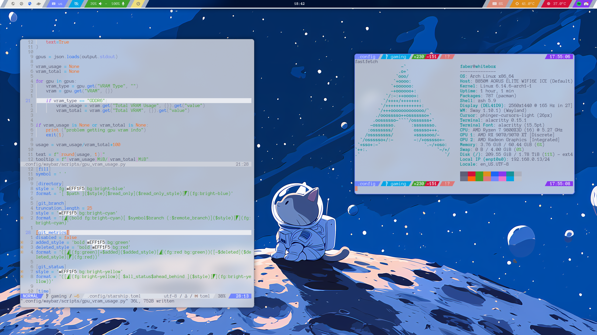

# Gaming dotfiles

Some of the configurations here are specifically targeted to my gaming PC and may not entirely work on other devices (e.g. the amd gpu script for waybar)

## Preview

## Dependencies

- [swayfx](https://github.com/WillPower3309/swayfx)
- [waybar](https://github.com/Alexays/Waybar)
- [alacritty](https://github.com/alacritty/alacritty)
- [wofi](https://hg.sr.ht/~scoopta/wofi)
- [neovim](https://github.com/neovim/neovim)
- [a nerdfont](https://www.nerdfonts.com/)
- [wlsunset](https://man.archlinux.org/man/wlsunset.1.en)
- firefox
- [slurp](https://archlinux.org/packages/extra/x86_64/slurp/)
- [grim](https://archlinux.org/packages/extra/x86_64/grim/)
- [phinger cursor theme](https://github.com/phisch/phinger-cursors)
